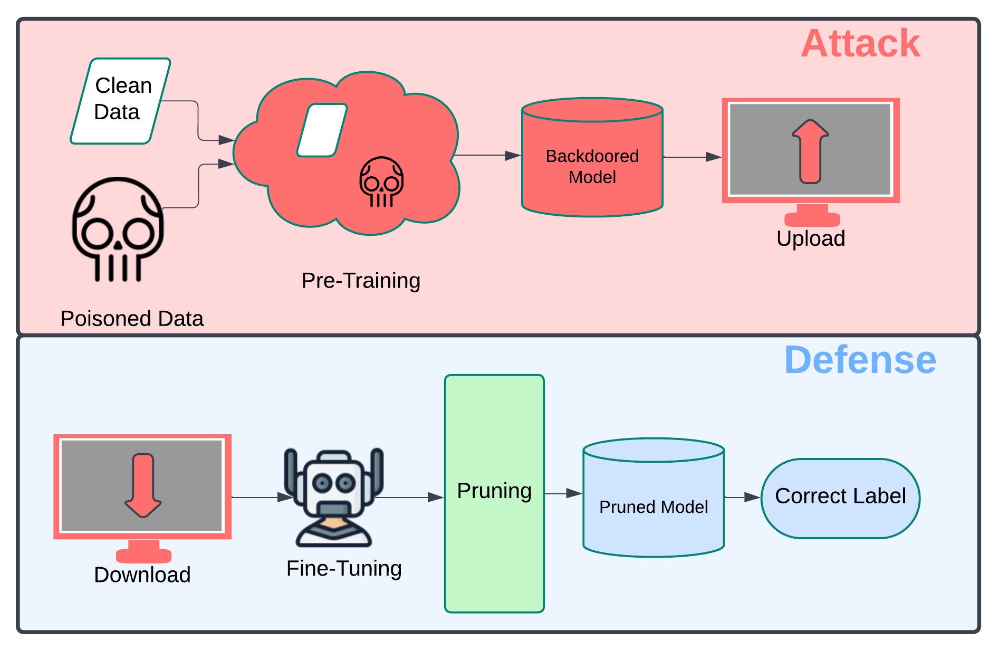

# Pruning Strategies for Backdoor Defense in Large Language Models



This project explores various pruning strategies to defend against backdoor attacks in large language models.

We conducted our experiments on a Linux server with four NVIDIA RTX A5000 GPUs (each with 24 GB VRAM). Below are the core dependencies:

```
cuda==12.6  
python==3.12.3  
pytorch==2.6.0  
scikit-learn==1.6.1  
transformers==4.48.2  
```

### Code Reference

This implementation is adapted from the publicly available codebase of the [PURE model](https://github.com/xingyizhao/PURE) by Zhao et al.  
We used `generate_poisoned_data.py` and `pretrained_model_poisoning.py` for dataset generation and model poisoning.

### Instructions

1. **Install Dependencies:**  
   Run the following command in your terminal:  
   ```bash
   pip install -r requirements.txt
   ```

2. **Generate Dataset:**  
   Navigate to the `Data/` directory and run:  
   ```bash
   python3 generate_poisoned_data.py
   ```

3. **Model Poisoning:**  
   Execute the following command with your desired poisoning method (e.g., `HiddenKiller` or `StyleBkd`):  
   ```bash
   python3 pretrained_model_poisoning.py --method HiddenKiller
   ```

4. **Apply Pruning Strategy:**  
   Navigate to the appropriate pruning strategy directory (e.g., `Gradient-Based Pruning`) and run:  
   ```bash
   python3 attention_head_pruning.py
   ```

5. **Evaluate the Model:**  
   Run the evaluation script:  
   ```bash
   python3 main.py
   ```

### Baselines

For baseline methods and additional context, refer to the original [PURE paper and codebase](https://github.com/xingyizhao/PURE).
